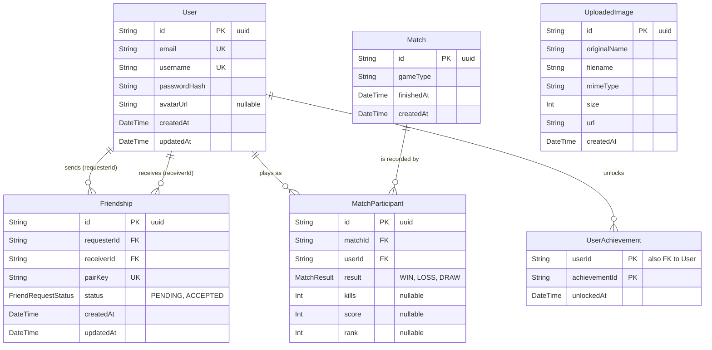

_This project has been created as part of the 42 curriculum by sshimura, ryomori, ttakino, rseki, yutakagi._

# ft_transcendence - DON'T PANIC!

## Description

**DON'T PANIC!** is a real-time multiplayer Bomberman-style web game built
as the final project of the 42 curriculum. Players can create or join game
rooms, play live matches from separate devices, manage their profiles and
friends, invite friends to games, and track their progress through match
history, rankings, and achievements.

The application uses a server-authoritative game loop: clients send player
input, while the server owns the game state and broadcasts synchronized updates
to connected players. Matches are rendered as a 3D scene with Three.js, the
interface follows an 8-bit galactic visual theme, and both keyboard and touch
controls are supported.

Key features include:

- Secure email-and-password authentication.
- Real-time lobby, room, invitation, chat, notification, and gameplay updates.
- Bomberman matches for two, three, or four simultaneous players, with reconnect and retirement handling.
- A 3D match view built with Three.js using Blender-authored assets and dynamic lighting.
- Profile editing, avatar upload, friend requests, and presence indicators.
- Match history, rankings, game statistics, and persistent achievements.
- HTTPS deployment with Docker Compose.

## Team Information

All team members contributed to development in addition to their primary
responsibilities.

| Member                                     | Primary role                  | Responsibilities                                                                                                    |
| ------------------------------------------ | ----------------------------- | ------------------------------------------------------------------------------------------------------------------- |
| [@sshimura](https://github.com/cimura)     | Product Owner and Developer   | Defined the product vision, prioritized the backlog, validated completed work, and coordinated feature integration. |
| [@ryomori](https://github.com/ryomori0113) | Project Manager and Developer | Organized planning and regular meetings, tracked progress and blockers, and coordinated project communication.      |
| [@ttakino](https://github.com/taka2162)    | Technical Lead and Developer  | Defined the technical architecture, made stack decisions, maintained code quality, and reviewed critical changes.   |
| [@rseki](https://github.com/rt6500)        | Developer                     | Implemented and tested user-facing account, profile, social, and statistics functionality.                          |
| [@yutakagi](https://github.com/LaLaSero)   | Developer                     | Implemented and stabilized real-time room, chat, and game-state behavior.                                           |

## Project Management

The team held regular meetings twice a week to review progress, discuss
blockers, refine priorities, and split work into reviewable tasks. GitHub Issues
were used as the backlog and task-tracking system; each issue described the
scope, priority, acceptance conditions, and dependencies where applicable.

Discord was the day-to-day communication channel for quick questions,
coordination, code-review discussion, and meeting follow-up. Work was developed
in branches, reviewed by teammates, and integrated through GitHub pull requests.

## Technical Stack

| Area                          | Technologies                                                | Why we chose them                                                                                   |
| ----------------------------- | ----------------------------------------------------------- | --------------------------------------------------------------------------------------------------- |
| Frontend                      | React 19, TypeScript, Vite, React Router                    | Component-based UI, type safety, fast local development, and client-side routing.                   |
| Styling and 3D rendering      | Tailwind CSS, Three.js, React Three Fiber, React Three Drei | Reusable visual primitives and an expressive 3D renderer for the game scene.                        |
| Client state and HTTP         | Zustand, Axios                                              | Lightweight state stores and a consistent API client.                                               |
| Backend                       | Node.js, NestJS, Express adapter                            | A modular, testable server architecture with validation, dependency injection, and REST support.    |
| Real-time communication       | Socket.IO                                                   | Authenticated bidirectional events for lobby, rooms, chat, notifications, presence, and game state. |
| Database                      | PostgreSQL 16, Prisma ORM                                   | Relational integrity for users and match data, plus type-safe database access and migrations.       |
| Authentication and validation | JWT, Passport, bcrypt, class-validator                      | Password hashing, authenticated API access, and validated client input.                             |
| File uploads                  | Multer, Docker volume                                       | Validated avatar uploads stored persistently outside the application container.                     |
| Deployment                    | Docker Compose, nginx, self-signed TLS certificate          | One-command local deployment and HTTPS as the public entry point.                                   |
| Quality                       | Jest, ESLint, Prettier, GitHub Actions                      | Automated tests, static checks, formatting checks, and CI for frontend and backend changes.         |

## Database Schema

PostgreSQL is managed through Prisma migrations. The schema is defined in
`backend/prisma/schema.prisma`. On container start, the backend image runs
`npm run prisma:deploy` to apply pending migrations before starting the
server: `npm run start:dev` in development (`docker/backend/Dockerfile`), or
the compiled output via `node dist/main.js` in production
(`docker/backend/Dockerfile.prod`).



| Table / model      | Key fields and data types                                                                                                                                                                                  | Relationships and constraints                                                                                                                                                                                                                                                                        |
| ------------------ | ---------------------------------------------------------------------------------------------------------------------------------------------------------------------------------------------------------- | ---------------------------------------------------------------------------------------------------------------------------------------------------------------------------------------------------------------------------------------------------------------------------------------------------- |
| `User`             | `id` `String` (UUID, PK), `email` `String` (unique), `username` `String` (unique), `passwordHash` `String`, `avatarUrl` `String?`, `createdAt`/`updatedAt` `DateTime`                                      | Sends and receives `Friendship` records, participates in matches through `MatchParticipant`, and owns `UserAchievement` records.                                                                                                                                                                     |
| `Friendship`       | `id` `String` (UUID, PK), `requesterId`/`receiverId` `String` (FK to `User`), `pairKey` `String` (unique), `status` `FriendRequestStatus` enum (`PENDING`, `ACCEPTED`), `createdAt`/`updatedAt` `DateTime` | Two relations to `User` (requester and receiver). `FriendsService` normalizes `pairKey` by sorting the two user IDs before writing, so the `pairKey` unique constraint rejects both `A→B` and `B→A`; the raw `[requesterId, receiverId]` unique constraint alone would not catch a mirrored request. |
| `Match`            | `id` `String` (UUID, PK), `gameType` `String`, `finishedAt` `DateTime`, `createdAt` `DateTime`                                                                                                             | Has zero or more `MatchParticipant` records; the schema does not enforce a minimum, but `ScoresService` only creates a `Match` together with its participants.                                                                                                                                       |
| `MatchParticipant` | `id` `String` (UUID, PK), `matchId`/`userId` `String` (FK), `result` `MatchResult` enum (`WIN`, `LOSS`, `DRAW`), `kills` `Int?`, `score` `Int?`, `rank` `Int?`                                             | Join model between `Match` and `User`. `[matchId, userId]` is unique, so a user appears at most once per match. Indexed on `userId` and `matchId` for history and ranking queries.                                                                                                                   |
| `UserAchievement`  | composite PK `[userId, achievementId]`, `userId` `String` (FK, `onDelete: Cascade`), `achievementId` `String`, `unlockedAt` `DateTime`                                                                     | Belongs to a `User`. Achievement definitions live in application code (`backend/src/scores/achievements/`), so `achievementId` is intentionally not a foreign key to a table.                                                                                                                        |
| `UploadedImage`    | `id` `String` (UUID, PK), `originalName`/`filename`/`mimeType`/`url` `String`, `size` `Int`, `createdAt` `DateTime`                                                                                        | Stores upload metadata only. A user's `avatarUrl` refers to the stored URL; this is deliberately a URL reference rather than a database foreign key.                                                                                                                                                 |

## Features List

| Feature                | Functionality                                                                                                                                           | Contributors                   |
| ---------------------- | ------------------------------------------------------------------------------------------------------------------------------------------------------- | ------------------------------ |
| Authentication         | Sign up and sign in with email and password; bcrypt hashing and JWT-protected requests.                                                                 | @ttakino, @rseki, @sshimura    |
| Profiles and avatars   | View and edit profiles, select a default avatar, upload validated avatar images, and manage account details.                                            | @rseki, @ryomori               |
| Friends and presence   | Search users, send and manage friend requests, remove friends, and display online, in-game, or offline presence.                                        | @rseki, @sshimura              |
| Lobby and invitations  | Create, browse, join, leave, and manage rooms; invite eligible friends to a room.                                                                       | @ttakino, @sshimura, @rseki    |
| Real-time Bomberman    | Run synchronized two-, three-, and four-player matches with server-owned state, disconnect/reconnect handling, retirement, and touch or keyboard input. | @ttakino, @yutakagi, @sshimura |
| 3D match rendering     | Render the board, players, bombs, and destructible blocks as a Three.js scene with glTF assets, shadow-mapped lighting, and a responsive camera rig.    | @ryomori, @ttakino             |
| Room chat              | Send and receive messages within a game room through Socket.IO event handlers.                                                                          | @yutakagi, @ttakino            |
| Notifications          | Receive and view in-application notifications for friend requests and game invitations.                                                                 | @sshimura, @ttakino            |
| Scores and progression | Persist match results, show history and rankings, calculate statistics, and unlock Galactic Guide achievements.                                         | @rseki, @ttakino               |
| Design system          | Deliver the galactic pixel-art visual language across the home, lobby, room, profile, friend, and settings screens.                                     | @ryomori, @rseki               |
| Delivery and quality   | Provide Docker-based HTTPS deployment, formatting and lint checks, automated backend tests, and GitHub Actions workflows.                               | @ttakino, @rseki, @sshimura    |

## Modules

The selected modules total **18 points** (8 Major x 2 + 2 Minor x 1), above the
14 points required. A module is claimed only through the functionality described
below and demonstrated in the running application.

| Category                   | Module                                      | Type  | Points | Implementation and contributors                                                                                                                                                                                                                                                                                                  |
| -------------------------- | ------------------------------------------- | ----- | -----: | -------------------------------------------------------------------------------------------------------------------------------------------------------------------------------------------------------------------------------------------------------------------------------------------------------------------------------- |
| Web                        | Frameworks for frontend and backend         | Major |      2 | React frontend and NestJS backend provide the project structure, routing, validation, and API layers. Contributors: all team members.                                                                                                                                                                                            |
| Web                        | Real-time features                          | Major |      2 | Socket.IO broadcasts authenticated lobby, room, presence, notification, and game updates, with connection and reconnection handling. Contributors: @ttakino, @yutakagi, @sshimura.                                                                                                                                               |
| Web                        | User interaction                            | Major |      2 | Users can access profiles, manage friends, and exchange messages in game rooms. Contributors: @rseki, @yutakagi, @ttakino.                                                                                                                                                                                                       |
| Gaming and user experience | Complete web-based game                     | Major |      2 | A live Bomberman-style game with clear elimination and ranking outcomes is rendered in the browser from server-owned state. Contributors: @ttakino, @yutakagi, @sshimura.                                                                                                                                                        |
| Gaming and user experience | Remote players                              | Major |      2 | Players on separate devices can join the same room, receive synchronized state, and recover from temporary disconnections. Contributors: @ttakino, @yutakagi.                                                                                                                                                                    |
| Gaming and user experience | Multiplayer game (more than two players)    | Major |      2 | Rooms can be created for **3 or 4 simultaneous players** in addition to 2. All participants share one server-owned session, so spawn positions, bomb ownership, eliminations, and final ranking stay fair and synchronized across every client. Contributors: @sshimura, @ttakino, @ryomori.                                     |
| Gaming and user experience | Advanced 3D graphics (Three.js)             | Major |      2 | The match is rendered as a real 3D scene with Three.js via React Three Fiber: Blender-authored glTF assets (field, destructible rocks, bomb), a procedurally generated UFO, dynamic lighting with shadow mapping, and a camera rig that reframes the board as the viewport changes. Contributors: @ryomori, @ttakino, @sshimura. |
| User management            | Standard user management and authentication | Major |      2 | Users can authenticate, edit profiles, upload or select avatars, add friends, view profiles, and see presence state. Contributors: @rseki, @ttakino.                                                                                                                                                                             |
| Web                        | Use an ORM for the database                 | Minor |      1 | Prisma is the single data-access layer: the schema is declared in `schema.prisma`, versioned migrations are applied automatically on backend startup, and a generated type-safe client is used for every query. Contributors: @rseki, @ttakino.                                                                                  |
| User management            | Game statistics and match history           | Minor |      1 | Match results are persisted and exposed through personal history, rankings, statistics, and achievement progression. Contributors: @rseki, @ttakino.                                                                                                                                                                             |
|                            | **Total**                                   |       | **18** |                                                                                                                                                                                                                                                                                                                                  |

### Why we chose these modules

- **Frameworks for frontend and backend.** The project is a real-time game with
  authenticated REST and WebSocket surfaces, so we wanted opinionated structure
  on both sides rather than assembling one ourselves. React gave us a component
  model for a UI that changes constantly, and NestJS gave us modules, dependency
  injection, and validation pipes that kept the growing socket and REST layers
  organized.
- **Real-time features.** A Bomberman match is meaningless without live state,
  so this module is the technical core of the product rather than an add-on. It
  also underpins the lobby, presence, chat, and notification features.
- **User interaction.** We wanted players to be able to find each other and
  coordinate before a match, which requires profiles, friends, and chat working
  together rather than any one of them alone.
- **Complete web-based game.** This is the centerpiece of the product; every
  other module exists to support getting players into a match and back out with
  a result.
- **Remote players.** Playing from separate devices is what makes the game worth
  building as a web application, and it forced us to solve latency and
  reconnection properly instead of assuming a stable connection.
- **Multiplayer game (more than two players).** Bomberman is far more
  interesting with three or four players, and supporting it meant our
  synchronization had to be genuinely correct rather than a special case for two
  clients.
- **Advanced 3D graphics.** An 8-bit galactic theme rendered in 3D gave the game
  a distinct identity, and it let one team member contribute modelling work in
  Blender that fed directly into the running application.
- **Standard user management and authentication.** Persistent identity is a
  prerequisite for friends, invitations, match history, and rankings, so this
  module unlocks most of the rest of the project.
- **Use an ORM.** Our schema has several relations and unique constraints that
  are easy to get wrong in raw SQL. Prisma gave us migrations we could review in
  pull requests and a generated client that made schema mistakes compile errors
  instead of runtime errors.
- **Game statistics and match history.** Persisting results gives matches
  consequences and gave us a reason to build rankings and the Galactic Guide
  achievement progression.

## Instructions

### Prerequisites

Docker is the only requirement; Node.js, PostgreSQL, and nginx all run inside
containers and do not need to be installed on the host.

| Tool           | Minimum version | Notes                                                                                                                                                                                                                                             |
| -------------- | --------------- | ------------------------------------------------------------------------------------------------------------------------------------------------------------------------------------------------------------------------------------------------- |
| Docker Engine  | 20.10           | Runs the containers and images defined in `docker/docker-compose.yml`.                                                                                                                                                                            |
| Docker Compose | v2              | Must be the Compose V2 plugin invoked as `docker compose`, not the legacy `docker-compose` binary. Required for the `depends_on: condition: service_healthy` syntax the `backend` service uses to wait on the `postgres` service's `healthcheck`. |
| GNU Make       | 3.81            | Optional. Every `make` target below is a thin wrapper around a `docker compose` command; run that command directly (see the `Makefile`) if `make` isn't available. |

We developed and verified the project on Docker Engine 29.5.3 with Docker
Compose 5.1.4. Check your installed versions with:

```bash
docker --version
docker compose version
```

A free TCP port `8443` on the host is also required, since nginx publishes the
HTTPS entry point there.

### Configure environment variables

Create your local environment file from the provided example:

```bash
cp .env.example .env
```

Generate a secret:

```bash
openssl rand -hex 32
```

Copy the generated value into `JWT_SECRET` in `.env`. The Makefile does not
create or overwrite `.env`; build targets fail with an explanation when the file
is missing.

| Variable                | Purpose                                                                                       |
| ----------------------- | --------------------------------------------------------------------------------------------- |
| `JWT_SECRET`            | Secret used to sign and verify JWTs. Required, minimum 32 characters.                         |
| `JWT_EXPIRES_IN`        | JWT lifetime, for example `1d` or `60s`.                                                       |
| `DATABASE_URL`          | PostgreSQL connection URL used by Prisma.                                                      |
| `POSTGRES_USER`         | PostgreSQL user name.                                                                          |
| `POSTGRES_PASSWORD`     | PostgreSQL password.                                                                           |
| `POSTGRES_DB`           | PostgreSQL database name.                                                                      |
| `SOCKET_IO_CORS_ORIGIN` | Comma-separated origins allowed to connect to the Socket.IO namespaces.                        |

Never commit `.env`; it contains local secrets. The backend validates
`JWT_SECRET` on startup. Production refuses known placeholder values and secrets
shorter than 32 characters, so the shipped `.env.example` cannot be used as-is.

### Build and start

`docker/docker-compose.yml` builds self-contained production images:
nginx serves the frontend's static `vite build` output directly (no separate
frontend container) and acts as the HTTPS reverse proxy, while the backend runs
the compiled `nest build` output with `node` directly (no devDependencies in
the final image). The Swagger UI is disabled in production, since it would
otherwise expose the full API schema publicly.

Start the application for the first time, or rebuild images after dependency or
Dockerfile changes:

```bash
make build
```

For later starts, use:

```bash
make
```

The first startup may take a little longer while Docker builds the images.
Prisma migrations are applied automatically each time the backend container
starts, so no manual migration step is needed.

### Access the application

- Application: <https://localhost:8443>
- API base path: `https://localhost:8443/api` (all REST routes are namespaced under it, for example `/api/auth/signin`)
- API health check: <https://localhost:8443/api/health>
- Privacy Policy: <https://localhost:8443/legal/privacy-policy>
- Terms of Service: <https://localhost:8443/legal/terms-of-service>

nginx is the public HTTPS entry point. The local certificate is self-signed, so
your browser will show a security warning that must be accepted for local use.
For a real deployment behind a public domain, replace it with a real
certificate (for example, mount it instead of generating it at build time in
`docker/nginx/Dockerfile.prod`).

You can verify the HTTPS endpoints from a terminal:

```bash
curl -kfsS -o /dev/null https://localhost:8443
curl -kfsS https://localhost:8443/api/health
```

Both commands exit with status `0` on success, and the second prints
`{"status":"ok"}`. The backend container uses the same `/api/health` endpoint as
its Docker healthcheck, and nginx only starts once that check passes.

### Useful commands

```bash
make logs       # Follow container logs
make down       # Stop containers
make rebuild    # Rebuild and recreate containers
```

To check Prisma migration status:

```bash
docker compose -f docker/docker-compose.yml exec -w /app/backend backend npm run prisma:migrate:status
```

## Individual Contributions

### @sshimura - Product Owner and Developer

- Maintained product direction, prioritization, integration, and feature validation.
- Implemented notification delivery and presentation, game invitations, socket namespace separation, and related room behavior.
- Contributed to authentication integration, security configuration, CI fixes, and review follow-up.

**Challenges.** Lobby traffic and in-game traffic initially shared a single
Socket.IO connection, so events intended for one context leaked into the other
and were hard to reason about. Splitting the lobby and the game onto separate
Socket.IO namespaces made each connection's event surface explicit and removed
a whole class of cross-talk bugs. A second problem was that rooms survived after
every player had left, cluttering the lobby with dead entries; the fix was to
delete a room as soon as it becomes empty. Tightening the socket CORS origins so
they come from an environment variable instead of being hard-coded also came out
of this work.

### @ryomori - Project Manager and Developer

- Coordinated planning, progress tracking, meetings, and team communication.
- Designed and implemented key visual screens and flows for the home, lobby, waiting room, settings, and friend interfaces.
- Authored the Blender 3D assets used in the match (field, destructible rocks, bomb) and the procedural UFO, and tuned the scene lighting and materials.
- Helped keep the pixel-art galactic UI consistent across user-facing features.

**Challenges.** The first Blender models did not sit correctly on the playing
field: geometry overlapped the ground plane and the flat colours made pieces
hard to tell apart during a match. Reworking the shapes and moving to metallic
materials fixed both the visual clash and the readability problem. Working on
shared UI files in parallel with the rest of the team also produced repeated
merge conflicts, which we reduced by splitting work into smaller pull requests
and rebasing on `develop` more frequently.

### @ttakino - Technical Lead and Developer

- Defined the React/NestJS/Prisma/Socket.IO architecture and maintained shared real-time contracts.
- Implemented and stabilized the server-authoritative game loop, rooms, connection recovery, countdown, rankings, and game rendering integration.
- Led technical refactoring, test improvements, build and CI maintenance, and critical code review.

**Challenges.** The hardest bug to track down only appeared in production:
React StrictMode double-invokes effects in development, which masked the fact
that our socket setup depended on that second invocation. Without StrictMode the
production build behaved differently, and the fix was to give each Socket.IO
namespace its own independent connection rather than sharing one. Concurrent
room joins were a second source of subtle breakage — a failed join could leave
partial state behind, so join operations became explicitly rollback-able, and a
bug where the rollback list was mutated while being iterated had to be fixed
before the recovery path was trustworthy. Finally, game constants had been
duplicated in the frontend and the backend and were drifting apart; moving them
into the `shared` workspace made the client and server agree by construction,
though it required sorting out how the workspace publishes its TypeScript
declarations.

### @rseki - Developer

- Implemented profile retrieval and editing, avatar upload and validation, friend management, and responsive profile/settings UI.
- Implemented match-result persistence, rankings, user statistics, achievements, and Galactic Guide progression.
- Added legal pages, tests, API connections, Docker fixes, and user-facing error handling.

**Challenges.** Three-player rooms exposed timing problems that two-player
rooms never hit: connections were established in an order the game setup did not
expect, so a third player could end up in a room whose game session had already
been initialized. Stabilizing the room and game connection sequence for three
players was the fix, and it made four-player matches work as a side effect.
Session handling caused a related issue — when the access token changed, sockets
kept using the old credentials until a reload, so socket reconnection is now
triggered explicitly on token change, and socket room joins are authorized and
rolled back on failure. On the UI side, browser back navigation from a room
disagreed with the in-app emergency exit and left users in an inconsistent
state, which was resolved by making both paths go through the same leave logic.

### @yutakagi - Developer

- Implemented room-chat Socket.IO handlers, chat history delivery, and serialized chat event processing.
- Contributed to countdown state handling and real-time room/game behavior fixes.
- Supported integration and review work around game state and room lifecycle behavior.

**Challenges.** Chat events were handled independently, so a client that fired
`chat:join`, `chat:message`, and `chat:leave` in quick succession could have them
interleave — a message could be processed before the join that authorized it, or
after the leave that should have ended it. Serializing all three event types
through a single per-connection queue made the ordering deterministic and
removed the race. The match countdown had a similar lifecycle problem: a player
leaving mid-countdown left the remaining clients with stale countdown state, so
countdown resets were unified into a single code path that runs regardless of
how the countdown ends.

## Resources

- [React documentation](https://react.dev/)
- [NestJS documentation](https://docs.nestjs.com/)
- [Socket.IO documentation](https://socket.io/docs/v4/)
- [Prisma documentation](https://www.prisma.io/docs/)
- [PostgreSQL documentation](https://www.postgresql.org/docs/)
- [Docker Compose documentation](https://docs.docker.com/compose/)
- [Three.js documentation](https://threejs.org/docs/)

### AI usage

AI was used to prepare initial drafts of the Privacy Policy and Terms of Service
pages, and to organize the README requirements and documentation structure. The
team reviewed, corrected, and took responsibility for the final legal text,
technical descriptions, and implementation decisions. AI-generated output was
not accepted without human review.
